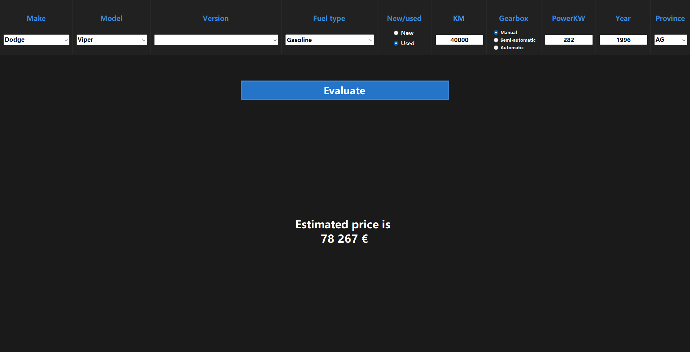
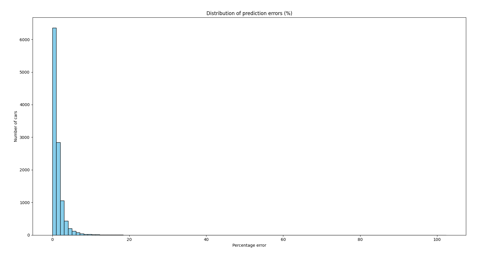

# AutoPredict
### Predict car prices with 96% accuracy for typical vehicles from 270,000 real Italian listings.

#### AutoPredict is a pet-project that turned into a complete application for **car price prediction**.   It scrapes **real listings from an Italian car marketplace** (over **270,000 cars** collected), processes the data, trains an ML model, and provides a **C# WinForms interface** to estimate the market value of any car by its specifications.

---

## Pipeline
1. Obtain the hidden JSON API of the marketplace and call it to get the JSON of all makes and models
2. Use the JSON to build targeted URLs for every make and model
3. Parse by the hierarchy: URLs → Pages → Ads into a `.csv` file
4. Clean and normalize the data using `Pandas`
5. Feed the data to a Gradient Boosting model (`CatBoost`) and save it
6. Compile the Python backend in `.exe` via the project-built constructor

---

## Tech Stack
- Python (Pandas, CatBoost)
- C# WinForms frontend
- JSON API parsing
- STDIN/STDOUT communication

---

## Model Performance

The trained model shows strong accuracy across the dataset:

| Metric | Value |
|--------|-------|
| Median Error (50th percentile) | 0.87% |
| Mean Error | 1.43% |
| 95th Percentile Error | 4.18% |
| Percentage of cars with error ≤ 5% | 96.41% |
| Percentage of cars with error ≤ 10% | 99.13% |

**Interpretation:**  
- **Median Error:** half of all cars are predicted with an error ≤ 0.87%, showing the model is very accurate for typical vehicles.  
- **Mean Error:** slightly higher than median due to rare or luxury cars with larger deviations.  
- **95th Percentile Error:** 95% of cars have an error ≤ 4.18%, with remaining 5% mainly being rare/expensive vehicles.  
- **Practical reliability:** nearly all cars have prediction errors below 10%, confirming the model’s robustness.

---

## Assembling
The constructor written in Python prepares everything except the interface (the application).  
The frontend is written in C# using WinForms. Once compiled as an `.exe`, it communicates with the Python backend via **STDIN/STDOUT**, sending data in JSON format and receiving the predicted result.

---

## How to compile
1. Run `main.py` with `build_release = True`  
2. Compile the C# client in Visual Studio: Build → Publish Selection → Publish with **ProduceSingleFile** checked  
3. Move the created `exe` to `backend/Release/App`

---

## Download

You can download the latest compiled version of **AutoPredict** here:  
👉 [Latest Release](https://github.com/Uladislau-Kulikou/AutoPredict/releases/latest)

The release contains:
- `predict.exe` (Python backend)
- `AutoPredict.exe` (C# WinForms client)
- All necessary runtime files packed in one archive

> ⚠️ Note: Only Windows is supported for now. No need to install Python or additional libraries — just download, unpack and run `AutoPredict.exe`.

